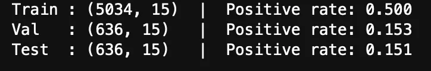
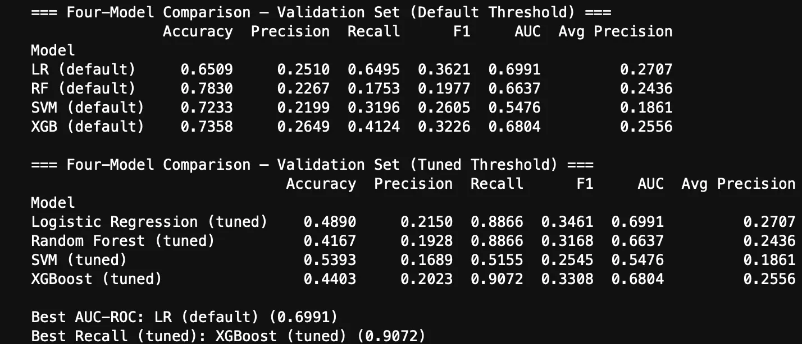
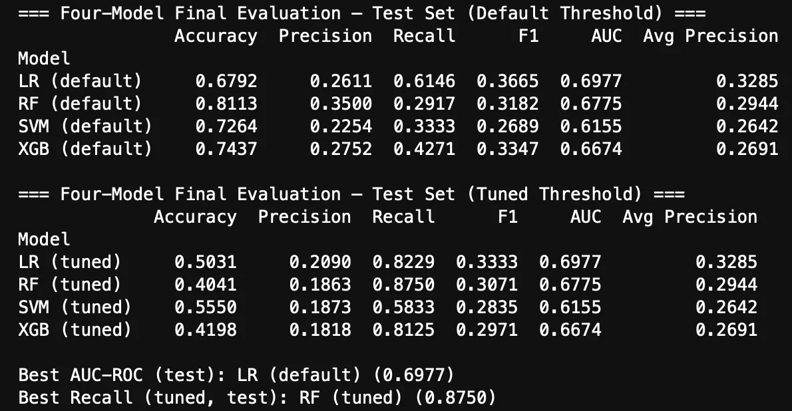
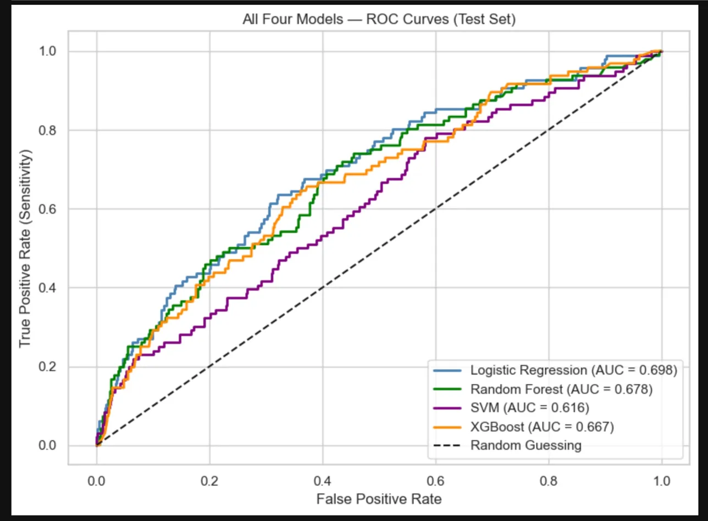
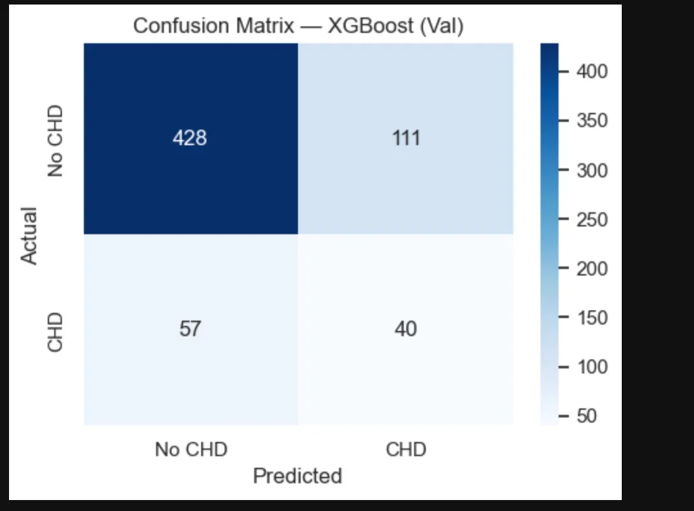

# Heart Disease Risk Prediction

## COMP 4600 — Health, Medicine & Machine Learning

Predicting ten-year coronary heart disease (CHD) risk using machine learning on the Framingham Heart Study dataset.

---

## Project Goal

Build and compare four binary classifiers to predict whether a patient will develop coronary heart disease within ten years, using clinical and demographic data from the Framingham Heart Study. The primary clinical goal is **high recall** — correctly identifying as many at-risk patients as possible — since missing a true positive is far more dangerous than a false alarm.

**Primary metrics:** AUC-ROC and Recall (Sensitivity)  
**Accuracy is not used** as a primary metric due to the 85/15 class imbalance.

---

## Dataset

| Property      | Value                                             |
| ------------- | ------------------------------------------------- |
| Source        | Framingham Heart Study (Kaggle / NHLBI)           |
| Format        | CSV — tabular data                                |
| Rows          | 4,240 patients                                    |
| Features      | 15 clinical + demographic features                |
| Target        | `TenYearCHD` — binary (0 = No Risk, 1 = CHD Risk) |
| Class balance | ~85% negative / ~15% positive                     |

**Feature categories:**

- **Demographic:** age, sex, education
- **Behavioral:** currentSmoker, cigsPerDay
- **Biomarkers:** totChol, sysBP, diaBP, BMI, heartRate, glucose
- **Medical history:** BPMeds, prevalentStroke, prevalentHyp, diabetes

---

## Repository Structure

```
COMP4600-Heart-Risk-Prediction/
├── data/
│   ├── raw/
│   │   └── framingham.csv          # Original dataset
│   └── processed/
│       ├── train.csv               # SMOTE-balanced, scaled training set
│       ├── val.csv                 # Scaled validation set (real distribution)
│       └── test.csv                # Scaled test set (real distribution)
├── models/
│   └── scaler.pkl                  # Fitted StandardScaler
├── notebooks/
│   ├── 01_eda.ipynb                # Exploratory data analysis
│   ├── 02_preprocessing.ipynb      # Data preprocessing pipeline
│   └── 03_modeling_FINAL_v4.ipynb  # Final modeling notebook
├── readme_assets/                  # Screenshots of successful outputs
├── environment.yml                 # Conda environment specification
├── requirements.txt                # Python package requirements
└── README.md
```

---

## Overall Workflow

```
Raw Data → EDA → Preprocessing → Modeling → Evaluation
  ↓           ↓         ↓            ↓            ↓
framingham  01_eda   02_preproc   03_model    metrics +
  .csv      .ipynb    .ipynb      _FINAL.ipynb  plots
```

1. **EDA** (`01_eda.ipynb`) — explore distributions, missing values, correlations
2. **Preprocessing** (`02_preprocessing.ipynb`) — imputation, splitting, scaling, SMOTE
3. **Modeling** (`03_modeling_FINAL_v4.ipynb`) — train, tune, and evaluate all four models

---

## Preprocessing Pipeline

All steps are implemented in `02_preprocessing.ipynb` and outputs are saved to `data/processed/`.

| Step                        | Method              | Detail                                                     |
| --------------------------- | ------------------- | ---------------------------------------------------------- |
| 1. Missing value imputation | Median imputation   | 7 columns — glucose (9.15%), education (2.48%), others <2% |
| 2. Train/val/test split     | Stratified 70/15/15 | Preserves ~15% positive rate in all three splits           |
| 3. Feature scaling          | StandardScaler      | Fit on train only — prevents data leakage                  |
| 4. Class balancing          | SMOTE               | Applied to training set only — val/test untouched          |

**Verified split sizes and positive rates:**



---

## Models

Four classifiers were trained and compared. All models load from the shared processed data files.

### Version 1 — Logistic Regression (Baseline)

- **Role:** Linear baseline — interpretable via coefficients
- **Tuning:** GridSearchCV over `C=[0.001, 0.01, 0.1, 1, 10, 100]` and `solver=['lbfgs', 'liblinear']`
- **CV Scoring:** F1 (balances precision and recall directly)

### Version 2 — Random Forest

- **Role:** Non-linear ensemble — captures feature interactions
- **Tuning:** GridSearchCV over `n_estimators=[100, 200, 300]`, `max_depth=[None, 10, 20]`, `min_samples_leaf=[1, 2, 4]`
- **CV Scoring:** Recall (directly optimises for catching CHD patients)

### Version 3 — SVM (RBF Kernel)

- **Role:** Kernel-based maximum-margin classifier
- **Tuning:** GridSearchCV over `C=[0.1, 1, 10]`, `gamma=['scale', 0.01, 0.1]`
- **CV Scoring:** AUC-ROC — Best params: C=10, gamma=0.1 (CV AUC: 0.9214)

### Version 4 — XGBoost

- **Role:** Gradient boosting with SHAP explainability
- **Tuning:** Two-stage — early stopping then GridSearchCV over `learning_rate` and `max_depth`
- **CV Scoring:** AUC-ROC — Best params: lr=0.05, max_depth=8 (CV AUC: 0.8667)

### Threshold Tuning (All Models)

- F2-optimised threshold found on validation set, applied to test set
- F2-score weights recall twice as heavily as precision — correct for medical screening

---

## Results

### Validation Set — Default & Tuned Threshold



### Test Set — Default & Tuned Threshold



### All Four Models — ROC Curves (Test Set)



### Sample Confusion Matrix — XGBoost (Validation Set)



> XGBoost correctly identified 40 true CHD patients (true positives) while missing 57 (false negatives) at the default threshold. After threshold tuning, recall improves significantly.

### Final Recommendation

| Purpose                | Model                 | AUC       | Recall (tuned) |
| ---------------------- | --------------------- | --------- | -------------- |
| Best AUC               | Logistic Regression   | **0.698** | 0.823          |
| Best Recall            | Random Forest (tuned) | 0.678     | **0.875**      |
| Recommended deployment | XGBoost (tuned)       | 0.667     | 0.813          |

---

## How to Build, Run, and Test

### 1. Clone the repository

```bash
git clone git@github.com:Aryan2521-04/COMP4600-Heart-Risk-Prediction.git
cd COMP4600-Heart-Risk-Prediction
```

### 2. Set up the environment

```bash
conda env create -f environment.yml
conda activate heart-risk
```

> **Mac users:** XGBoost is installed via conda-forge which bundles its own OpenMP.  
> Do NOT install xgboost via pip — it will fail with a `libomp.dylib` error on Mac.

### 3. Add the raw data

Place `framingham.csv` in `data/raw/framingham.csv`.  
Dataset available on Kaggle: [Framingham Heart Study](https://www.kaggle.com/datasets/amanajmera1/framingham-heart-study-dataset)

### 4. Run notebooks in order

| Order | Notebook                     | What it does                                      | Expected output                                            |
| ----- | ---------------------------- | ------------------------------------------------- | ---------------------------------------------------------- |
| 1     | `01_eda.ipynb`               | EDA — distributions, missing values, correlations | Plots and summary stats                                    |
| 2     | `02_preprocessing.ipynb`     | Imputation, split, scaling, SMOTE                 | Saves `data/processed/` CSVs and `models/scaler.pkl`       |
| 3     | `03_modeling_FINAL_v4.ipynb` | Train, tune, and evaluate all 4 models            | Metrics tables, confusion matrices, ROC curves, SHAP plots |

```bash
conda activate heart-risk
jupyter notebook
```

Select **Kernel → Change Kernel → heart-risk** in each notebook.  
If `heart-risk` doesn't appear:

```bash
python -m ipykernel install --user --name heart-risk --display-name "heart-risk"
```

---

## Required Packages

| Package          | Version | Notes                             |
| ---------------- | ------- | --------------------------------- |
| python           | 3.11    |                                   |
| numpy            | ≥1.24   |                                   |
| pandas           | ≥2.0    |                                   |
| scikit-learn     | ≥1.3    |                                   |
| xgboost          | ≥2.0    | conda-forge only — NOT pip on Mac |
| shap             | ≥0.43   | pip                               |
| matplotlib       | ≥3.7    |                                   |
| seaborn          | ≥0.12   |                                   |
| imbalanced-learn | ≥0.12   | For SMOTE                         |
| jupyter          | ≥1.0    |                                   |

---

## Known Limitations & Reproducibility Notes

- **Mac OpenMP:** XGBoost must be installed via conda-forge. Pip installation fails with `libomp.dylib not found`.
- **Execution order:** `02_preprocessing.ipynb` must run before the modeling notebook — it generates `data/processed/`.
- **SMOTE seeding:** Results reproducible with `random_state=42` but may vary slightly across scikit-learn versions.
- **Dataset bias:** Framingham cohort (1948–2005) is predominantly white and middle-class from Massachusetts. May not generalise to modern or diverse populations.
- **Val/test sets:** Never apply SMOTE to val or test sets — they must reflect the real-world 15% positive rate for honest evaluation.

---

## Team Contributions

| Team Member          | Role                         | Contributions                                                                                     |
| -------------------- | ---------------------------- | ------------------------------------------------------------------------------------------------- |
| Aryan Shah           | Random Forest + Project Lead | EDA notebook, preprocessing pipeline, RF model, notebook merging, final modeling notebook, README |
| Vin Patel            | Logistic Regression          | LR model implementation, baseline evaluation                                                      |
| Elyas Khoubach       | SVM                          | SVM implementation with GridSearchCV tuning                                                       |
| Matias Elban Stringa | XGBoost                      | XGBoost implementation, early stopping, SHAP analysis                                             |

---

## Evidence of Testing

Screenshots of all successful outputs are embedded above. Key verified results:

- ✅ Train positive rate: 0.500 (SMOTE balanced)
- ✅ Val positive rate: 0.153 (real distribution preserved)
- ✅ Test positive rate: 0.151 (real distribution preserved)
- ✅ SVM best params: C=10, gamma=0.1 (CV AUC: 0.9214)
- ✅ XGBoost best params: lr=0.05, max_depth=8 (CV AUC: 0.8667)
- ✅ Best AUC (test): LR default — 0.698
- ✅ Best Recall (tuned, test): RF tuned — 0.875
- ✅ Best Recall (tuned, val): XGBoost tuned — 0.907
- ✅ All confusion matrices, ROC curves, PR curves generated without errors
- ✅ SHAP plots generated for XGBoost on validation set
